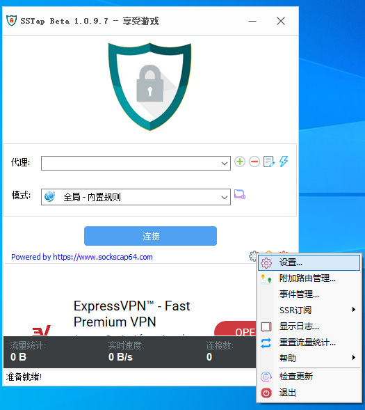
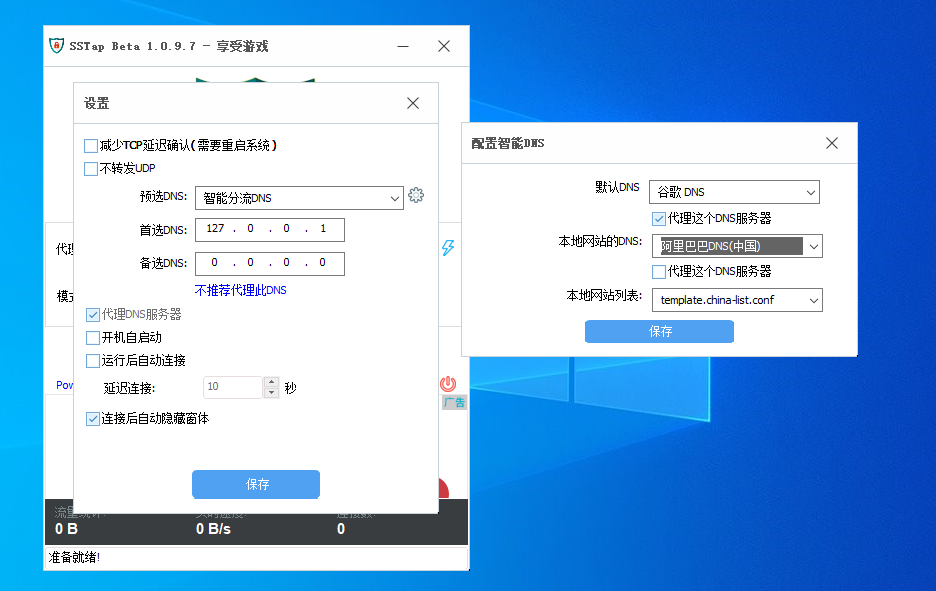

# SSTap-Rule

## 相关推荐

[**翻墙功夫网 :100:**](https://geckoiplc.com/register?aff=SSvrgZkX)

这是我所选择的服务器提供商，IPLC专线翻墙、稳定、速度快、价格便宜。欢迎大家使用我的推广链接前去注册。

[点我注册](https://geckoiplc.com/register?aff=SSvrgZkX)

**适用sstap版本：1.0.9.7** 

   
 [点我进入下载页面](https://github.com/FQrabbit/SSTap-Rule/releases/tag/SSTap常用版本及去广告) 

## 相关说明

>SStap官方网站：[sstap-享受游戏-使用sstap](https://www.sockscap64.com/sstap-享受游戏-使用sstap/) 
>
>SSTap已于2017年11月19日停止开发及维护. 

由于作者的原因，停止了更新SSTap，但SStap所用到的修改系统路由表的方法依旧可用。

但由于规则更新不及时以及 udp 地址覆盖不全，即日起我们将SStap的使用方法改变为 `绕过中国大陆`，即全局模式进行分流，DNS也会分流 ，来优化对游戏的加速方案，同时项目会不定时更新可用的加速游戏 tcp 连接的规则，即改善某些游戏与服务器连接质量，如`Warframe 游戏更新`。

### 使用方法

- 继续前，你应该清楚基础用法，如添加代理。

-  [点我进入规则包下载页面](https://github.com/FQrabbit/SSTap-Rule/releases)

- 下载规则存档的zip包。

- 打开你 SSTap 所在文件夹：  
    - 在开始菜单中的快捷方式：右击 SSTap 快捷方式，选择打开文件位置。此时在弹出的窗口中你还会看到一个 SSTap 快捷方式。右击它，再选择一次打开文件位置。  
    - 在桌面 / 其他位置的快捷方式：右击快捷方式，选择打开文件位置。

- 将压缩包中的所有文件夹解压到SSTap 文件夹，选择全部覆盖。

- 打开SStap，点击右下角齿轮，选中设置。

- 勾选代理DNS服务器，在预选DNS一栏选中`智能分流DNS`，点击右侧齿轮，按照图中进行设置，也可以选择自己需要的DNS，更改其他DNS后的第一次连接会需要一两分钟左右来启用新配置，建议按照下图进行设置，无需重新修改，然后点击保存。（可忽略设置中`不建议代理此DNS`）

以上的DNS服务默认仅支持64位系统，判断系统为64位还是32位，参见 (查询教程)[http://www.xitongcheng.com/jiaocheng/win10_article_44605.html]

如果系统为32位，需将`unbound文件夹` 中的 `unbound_w32` 程序更名为 `unbound` 并覆盖已有文件。

规则需选用 `不代理中国IP且绕过局域网` ，点击连接后会有一到两分钟的写入路由表时间，期间CPU占有率略有升高，个人是占用20%，持续两分钟。也可选择 `不代理中国IP且绕过局域网-精简版` ，减少写入时间。

设置完成后，规则中的大陆IP会直连，DNS也会分流，大陆内域名向大陆DNS查询，大陆外域名向设置的DNS进行查询。

### 服务器的选择

游戏加速需服务器支持udp转发，建议使用项目推荐机场（看上面）。一般来说，使用SStap带来的NAT问题影响不大，而且还有其他因素在影响NAT类型，当你认识到了NAT问题的确给你带来游戏性能影响，可以去使用 Netch。

